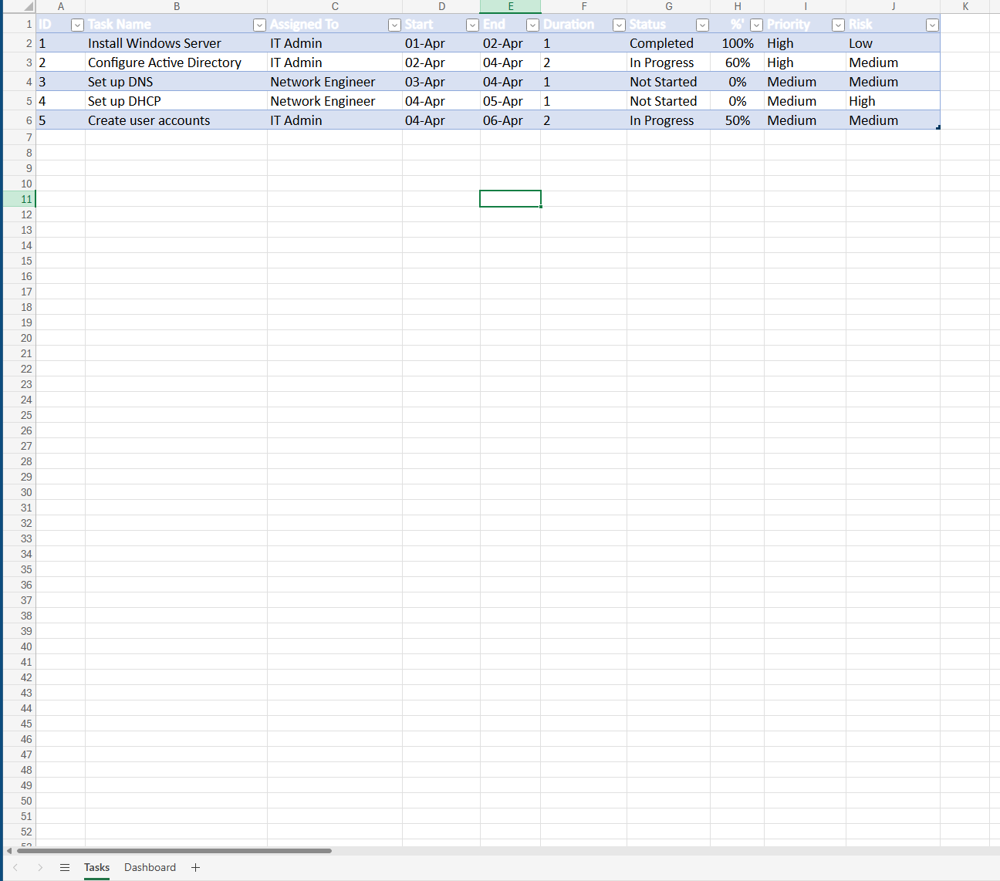
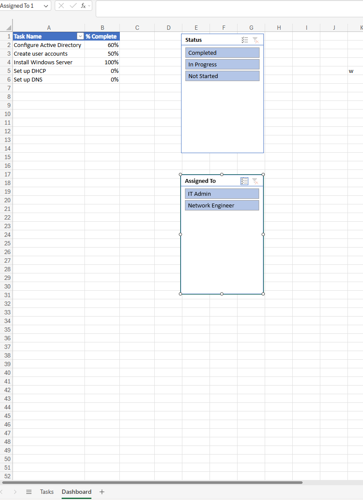

# IT Project Dashboard

## Project Overview

In this project I built an Excel dashboard to track a small IT infrastructure setup.

The aim was to simulate how tasks are managed and monitored in a real IT environment, using something simple but still realistic.

The project includes tasks such as:

- Active Directory setup
- DNS and DHCP configuration
- User account creation
- Network setup and testing

The focus was on tracking progress, assigning work, and getting a clear overview of how the project is moving.

---

# Project Structure

The workbook is split into two main sheets:

1. Tasks
2. Dashboard

The Tasks sheet holds all the raw data and calculations.

The Dashboard is where that data is summarised and visualised, so it is easier to understand at a glance.



---

# Tools and Features Used

- Microsoft Excel
- Tables
- Formulas
- Data Validation (dropdown lists)
- Pivot Tables
- Slicers
- Pie Chart

---

# Tasks Sheet Setup

## Creating the Task Table

I created a structured table to store all project data:

- Task ID
- Task Name
- Assigned To
- Start Date
- End Date
- Duration
- Status
- % Complete
- Priority
- Risk

Each row represents a task, and each column tracks a specific part of that task.

This acts as the central dataset for everything in the dashboard.

---

# Duration Calculation

To calculate how long each task takes, I used:

```excel
=[@End]-[@Start]
```
### Why this works

Excel stores dates as numbers in the background, so subtracting one date from another returns the number of days between them.

### What this does

This means I do not have to manually calculate durations. If I change a start or end date, the duration updates automatically.

---

## Data Validation (Dropdown Lists)

To keep the data clean and consistent, I used dropdown lists.

### Status

- Completed  
- In Progress  
- Not Started  

### Priority / Risk

- Low  
- Medium  
- High  

### How I added them

1. Selected the column  
2. Went to **Data → Data Validation**  
3. Chose **List**  
4. Entered the values  

### Why I used this

Without dropdowns, it is easy to enter slightly different values such as:

- complete  
- Completed  
- done  

This would break formulas and summaries.

Using dropdown lists ensures the data stays consistent and reliable.

---

## Dashboard Sheet

### Pivot Table (Task Progress)

I created a pivot table to summarise task progress.

#### Setup

- Rows → Task Name  
- Values → % Complete (Average)  

### Why I used average

If I summed percentages, the result would not make sense because it could go over 100%.

For example:

- 100% + 60% + 0% = 160%  

Using average gives a more accurate representation of progress.

### What this does

It allows me to quickly see how complete each task is without scanning the full dataset.



---

## Slicers (Filters)

I added slicers for:

- Status  
- Assigned To  

### Why I used slicers

They make the dashboard interactive.

Instead of manually filtering the table, I can quickly:

- view only tasks in progress  
- check what a specific person is working on  

This makes the dashboard faster and easier to use.

---

## Status Summary Table

I created a small summary table to count how many tasks fall into each status:

- Completed  
- In Progress  
- Not Started  

### Formulas used

```excel
=COUNTIF(G:G,"Completed")
=COUNTIF(G:G,"In Progress")
=COUNTIF(G:G,"Not Started")
```
### Why I used this

The raw data is not suitable for charts directly.

This step converts it into a simple summary that can be visualised properly.

It also updates automatically whenever the task statuses change.

---

## Pie Chart (Project Overview)

I created a pie chart using the status summary table.

### Why I used this

It gives a quick visual breakdown of the project:

- how much is completed  
- what is still in progress  
- what has not been started  

This is useful for quickly understanding the overall state of the project.


---

## What I Learned

This project helped me understand how task tracking and reporting works in practice.

I improved my ability to:

- structure and organise data clearly  
- use formulas to automate calculations  
- summarise data using pivot tables  
- build simple dashboards for quick insights  

It also showed me how small changes, such as dropdown lists and summary tables, make a big difference in keeping data accurate and usable.
